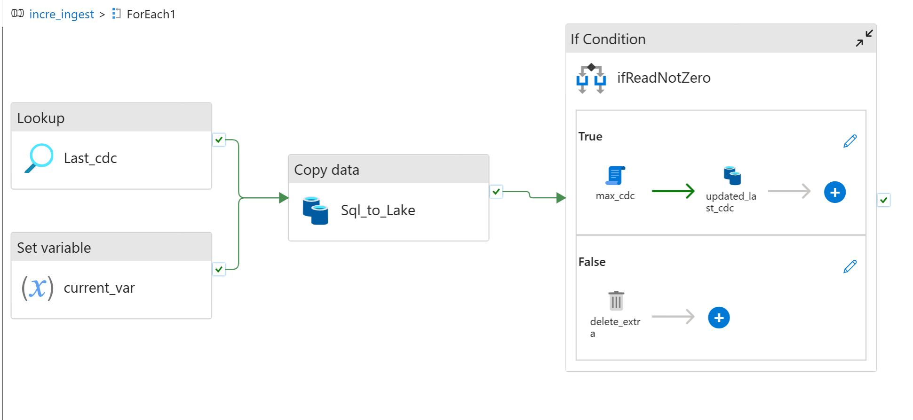
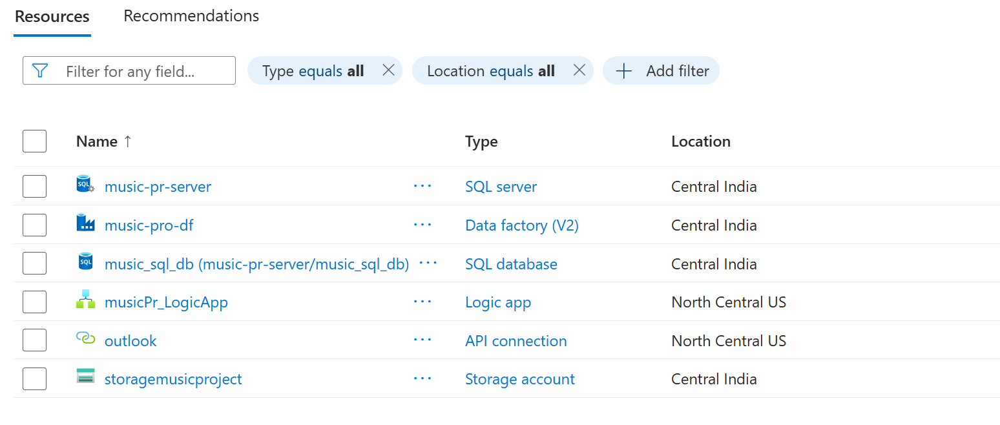
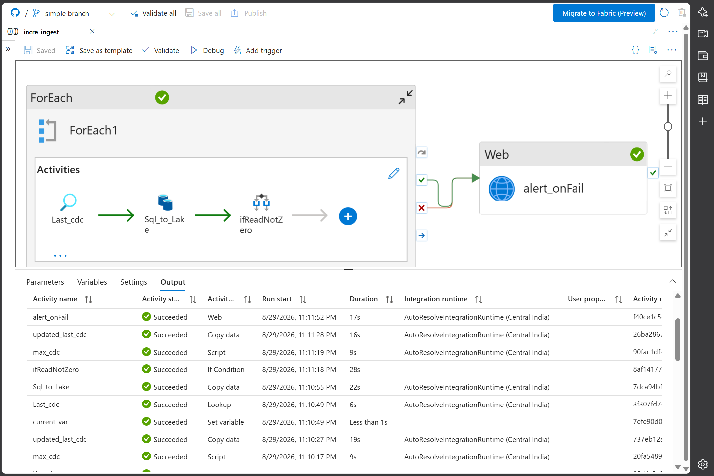

# 🎵 Music App Data Pipeline — Azure Data Engineering Project

> **Status:** 🚧 In Progress — Bronze (Ingestion) Layer Complete  
> **Tech Stack:** Microsoft Azure | Azure Data Factory | Azure Data Lake Storage | Azure SQL Database  
> **Focus:** Production-grade data ingestion with monitoring and alerting

---

## 📖 Project Overview

This is a hands-on **Azure data engineering project** that builds an end-to-end data pipeline for a music application. The pipeline ingests raw music data from multiple source files, stores it in a data lake, and loads structured records into Azure SQL Database. The implementation follows modern medallion architecture patterns with a focus on **reliability, monitoring, and alerting**.

**Current Progress:** ✅ **Bronze Layer (Ingestion) Complete**  
Implemented a metadata-driven ingestion pipeline using Azure Data Factory with automated alerts for pipeline success and failure.

---

## 🏗️ Pipeline Architecture

---

## 🖼️ Project Highlights

### 1️⃣ Pipeline Overview

The `incre_ingest` pipeline uses a **metadata-driven, loop-based design** to process multiple music data files dynamically. It reads JSON sources from Azure Data Lake Storage and loads them into Parquet format and Azure SQL Database tables.


*ADF pipeline design showing ForEach loop and Copy Data activities for scalable ingestion*

---

### 2️⃣ Azure Resources Used

This project leverages core Azure services to build a production-ready data platform:

- **Azure Data Factory:** Orchestration and data movement
- **Azure Data Lake Storage Gen2:** Scalable data lake for raw and processed data
- **Azure SQL Database:** Structured bronze tables for analytics
- **Azure Monitor / Logic Apps (planned):** Alerting on pipeline success and failure


*Azure resource group showing ADF, ADLS Gen2, and Azure SQL Database deployments*

---

### 3️⃣ Ingestion with Alerting (Success & Failure)

The pipeline includes **automated alerting** to notify stakeholders on both successful and failed executions. This ensures visibility into data freshness and quick response to failures.

- ✅ **Success Alert:** Confirms data ingestion completed, includes row counts and duration
- ❌ **Failure Alert:** Notifies on pipeline errors with activity-level failure details


*ADF Monitor showing successful pipeline run with alerting workflow for success/failure notifications*

---

## 📁 Repository Structure

---

## ✅ What's Implemented

### Bronze (Ingestion) Layer

- **Metadata-driven pipeline:** ForEach loop iterates over configurable source files
- **Dynamic datasets:** Parameterized file paths and table names for reusability
- **Multi-sink ingestion:** JSON → Parquet (ADLS) + Azure SQL Database
- **Alerting workflow:** Success and failure notifications via Azure Monitor / Logic Apps
- **Scalable pattern:** Add new source files without duplicating pipeline logic

### Key Components

| Component | Purpose |
|---|---|
| Azure Data Factory | Pipeline orchestration and data movement |
| Azure Data Lake Storage | Raw and processed data lake (Parquet) |
| Azure SQL Database | Structured bronze tables for querying |
| Dynamic Datasets | Reusable, parameterized source/sink configurations |
| Alerting | Automated notifications on pipeline success/failure |

---

## 🚀 What's Next

### Phase 2: Silver Layer (Transformation)
- Data cleaning, deduplication, and schema validation
- PySpark transformations (Azure Databricks / Synapse)
- Watermark-based incremental loading

### Phase 3: Gold Layer (Curated Models)
- Dimensional modeling (star schema)
- Aggregated tables for analytics
- Data quality framework and monitoring

### Phase 4: Consumption & DevOps
- Power BI dashboards and SQL analytics
- CI/CD pipelines (Azure DevOps / GitHub Actions)
- Azure Key Vault integration for secrets management

---

## 🛠️ Technologies

| Category | Technology |
|---|---|
| Cloud Platform | Microsoft Azure |
| Orchestration | Azure Data Factory |
| Storage | Azure Data Lake Storage Gen2 |
| Database | Azure SQL Database |
| Compute (Future) | Azure Databricks / Synapse |
| Analytics (Future) | Power BI |
| DevOps (Future) | Azure DevOps / GitHub Actions |

---
## 📝 How to Run

### Prerequisites

- Azure subscription with ADF, ADLS Gen2, and Azure SQL Database
- Music dataset (JSON files)
- Basic familiarity with Azure Data Factory Studio

### Setup Steps

1. **Clone the repository**
   ```bash
   git clone https://github.com/devvratin/music_pr.git
   cd music_pr
   ```

2. **Create Azure resources**
   - Provision ADF, ADLS Gen2, and Azure SQL Database

3. **Import ADF artifacts**
   - In ADF Studio, connect to this GitHub repository or import JSON files
   - Publish linked services, datasets, and pipelines

4. **Configure linked services**
   - Update `AzureDataLakeStorage1.json` with your ADLS account
   - Update `AzureSqlDatabase1.json` with your SQL server and database

5. **Upload source data**
   - Upload JSON files to the configured ADLS container
   - Update `loop_input` with file paths and mappings

6. **Run the pipeline**
   - Open `incre_ingest` in ADF Studio
   - Trigger a debug run or add a trigger
   - Monitor execution and validate alerts

7. **Validate output**
   - Check Parquet files in ADLS processed folder
   - Query Azure SQL tables to verify data loads

---

## 📚 Key Learnings

- Designed metadata-driven ADF pipelines with ForEach and dynamic datasets
- Configured linked services for ADLS and Azure SQL
- Implemented Copy Data activities with multiple sinks
- Set up monitoring and alerting for pipeline success/failure
- Organized ADLS with raw/bronze and processed folder structures
- Version-controlled ADF artifacts in GitHub with clear documentation

---

## 👨‍💻 Author

**Devvrat**  
Aspiring Data Engineer | Microsoft Azure Learner  
📍 Delhi, India  
🔗 [LinkedIn](https://linkedin.com/in/devvrat-pandey) | 🐙 [GitHub](https://github.com/devvratin)

---

*Last Updated: August 2026*
